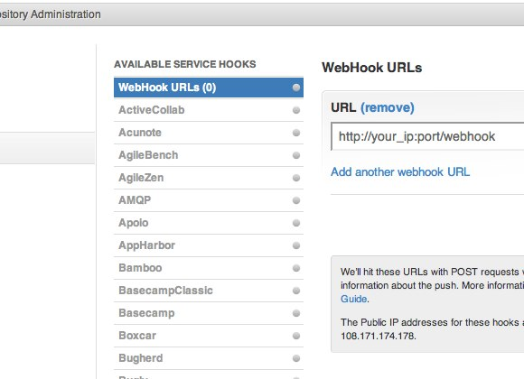
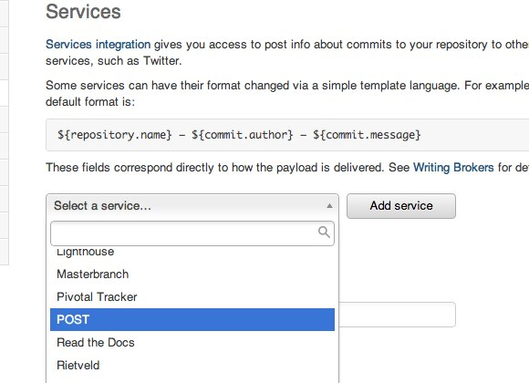

.. _goodies:

Goodies
==========

Gifts that makes Felix Felicis easy to use.

.. _preview-server:

Preview Server
---------------

Preview your blog with::

    $ liquidluck server
    $ liquidluck server -p 8888
    $ liquidluck server -p 8888 -s settings.py

The preview server now supports livereload.
This means that when you are editing a post,
it will auto-build the site and auto refresh the browser for you.
This feature was **Added in version 1.12**.

To enable livereload, your should install tornado::

    $ pip install tornado

Oh My Zsh Plugin
------------------

If you are using `oh-my-zsh <https://github.com/robbyrussell/oh-my-zsh>`_,
there is a plugin for you.

https://github.com/lepture/liquidluck/tree/master/oh-my-zsh-plugins

Copy ``liquidluck`` to ``~/.oh-my-zsh/plugins``::

    $ cp -r oh-my-zsh-plugins/liquidluck ~/.oh-my-zsh/plugins/

Then edit your zshrc file::

    plugins=(git ... liquidluck)

Now you can tab complete every Felix Felicis command::

    $ liquidluck b(tab)
    $ liquidluck build (tab)

Webhook
----------

Felix Felicis supports webhook since v1.6. When you push to GitHub or BitBucket,
your blog can generate itself.

First, you need to install Felix Felicis on your server::

    $ pip install liquidluck

Second, clone your blog repo to your server::

    $ git clone git://path/to/your/repo blog

Then, start webhook daemon in your blog::

    $ cd blog
    $ liquidluck webhook start -p 9876

Configure webhook on GitHub or BitBucket.

Head over to your blog source repo admin and select **Service Hooks**:

If you prefer BitBucket, you should select the POST service:

If your server ip is 88.88.88.88, you can add a URL::

    http://88.88.88.88:9876/webhook

And when you push to GitHub/Bitbucket,
your server will update the repo and generate the whole site.
